# Swift 6 Strict Concurrency Compliance - TASKS.md

## Plan Overview

**Epic**: Swift 6 Strict Concurrency Compliance  
**Source**: `.wfc/epics/swift6-compliance/ba-output.json`  
**Total Errors**: 1,406 errors across 50 files  
**Approach**: 4-phase migration with intermediate validation  
**Constraint**: `-strict-concurrency=complete` (no downgrading)

---

## Dependency Graph

```mermaid
graph TD
    %% Phase 1 (Foundation)
    A1[TASK-SW6-001: MockService Sendable Compliance] --> A2[TASK-SW6-002: Test Double Sendable]
    A2 --> A3[TASK-SW6-003: SettingsStore Mock Fix]
    A3 --> A4[TASK-SW6-004: Type Inference Fixes]
    
    %% Phase 1 -> Phase 2
    A4 --> B1[TASK-SW6-005: Protocol @MainActor Audit]
    
    %% Phase 2 (Protocols)
    B1 --> B2[TASK-SW6-006: TranscriptionService Protocol]
    B2 --> B3[TASK-SW6-007: Actor-Protocol Conformance]
    B3 --> B4[TASK-SW6-008: Visibility Mismatch Fixes]
    B4 --> B5[TASK-SW6-009: Nonisolated Member Audit]
    
    %% Phase 2 -> Phase 3
    B5 --> C1[TASK-SW6-010: NSLock Replacement]
    
    %% Phase 3 (Actors)
    C1 --> C2[TASK-SW6-011: CircularBuffer Actor Safety]
    C2 --> C3[TASK-SW6-012: AudioEngine State Isolation]
    C3 --> C4[TASK-SW6-013: @unchecked Sendable Documentation]
    
    %% Phase 3 -> Phase 4
    C4 --> D1[TASK-SW6-014: Test Target Compilation]
    
    %% Phase 4 (Tests)
    D1 --> D2[TASK-SW6-015: Test Double Swift 6 Update]
    D2 --> D3[TASK-SW6-016: CI/CD Swift 6 Pipeline]
    D3 --> D4[TASK-SW6-017: Migration Guide]
    
    %% Parallel tracks
    subgraph "Phase 1: Mock Infrastructure"
        A1
        A2
        A3
        A4
    end
    
    subgraph "Phase 2: Protocol Layer"
        B1
        B2
        B3
        B4
        B5
    end
    
    subgraph "Phase 3: Actor Implementation"
        C1
        C2
        C3
        C4
    end
    
    subgraph "Phase 4: Testing & CI/CD"
        D1
        D2
        D3
        D4
    end
```



---

## Execution Waves Summary

| Wave | Phase | Tasks | Error Target | Parallelizable |
|------|-------|-------|--------------|----------------|
| **Wave 1** | Phase 1 - Mock Services | 4 tasks | 500 errors | Yes (within wave) |
| **Wave 2** | Phase 2 - Protocols | 5 tasks | 550 errors | Sequential (dependencies) |
| **Wave 3** | Phase 3 - Actors | 4 tasks | 250 errors | Partial |
| **Wave 4** | Phase 4 - Tests/CI | 4 tasks | 106 errors | Yes |

---

## Phase 1: Mock Services (REQ-002, REQ-005) - 500 Errors

### Wave 1 - Foundation

## TASK-SW6-001: MockService Sendable Compliance
- **Complexity**: M
- **Dependencies**: []
- **Canary**: true
- **Wave**: 1
- **REQ Mapping**: REQ-002 (Sendable Violations)
- **Files Affected**:
  - `OpenOats/Sources/OpenOats/Infrastructure/Services/MockServiceFactory.swift`
  - `OpenOats/Sources/OpenOats/Infrastructure/Services/MockRepositories.swift`
- **Error Pattern**: `Type 'X' does not conform to Sendable protocol`
- **Acceptance Criteria**:
  - [ ] `MockServiceFactory` conforms to `Sendable` protocol
  - [ ] All mock service registrations use `Sendable` type constraints
  - [ ] Zero Sendable violations in MockServiceFactory.swift
  - [ ] SAFETY comment added for any `@unchecked Sendable` with thread-safety rationale
- **Estimated Time**: 4 hours

**Implementation Notes**:
```swift
// SAFETY: MockServiceFactory uses immutable service registry protected by actor isolation
// All registered services are Sendable-compliant before registration
public actor MockServiceFactory: Sendable {
    private var registry: [String: any Sendable] = [:]
    
    public func register<T: Sendable>(_ service: T, for type: String) {
        registry[type] = service
    }
}
```

---

## TASK-SW6-002: Test Double Sendable Compliance
- **Complexity**: M
- **Dependencies**: [TASK-SW6-001]
- **Canary**: false
- **Wave**: 1
- **REQ Mapping**: REQ-002 (Sendable Violations)
- **Files Affected**:
  - `OpenOats/Sources/OpenOats/Infrastructure/Services/MockRepositories.swift`
  - `OpenOats/Sources/OpenOats/Infrastructure/Services/MockLLMServices.swift`
- **Error Pattern**: `Capture of 'X' with non-Sendable type 'Y' in 'Sendable'-conforming context`
- **Acceptance Criteria**:
  - [ ] `MockSettingsRepository` conforms to `Sendable`
  - [ ] All observer callbacks use `@Sendable` closure types
  - [ ] `MockAISuggestionService` actor properly handles protocol conformance
  - [ ] Zero Sendable violations in mock repository files
- **Estimated Time**: 4 hours

**Implementation Notes**:
- Replace observer dictionary with `Sendable`-compatible storage
- Use `@Sendable` for all closure properties in mocks
- Add `Sendable` conformance to all mock entities

---

## TASK-SW6-003: SettingsStore Mock Fix
- **Complexity**: S
- **Dependencies**: [TASK-SW6-002]
- **Canary**: false
- **Wave**: 1
- **REQ Mapping**: REQ-002 (Sendable Violations)
- **Files Affected**:
  - `OpenOats/Sources/OpenOats/Settings/SettingsStore.swift`
  - `OpenOats/Sources/OpenOats/Infrastructure/Services/MockRepositories.swift`
- **Error Pattern**: `Call to non-Sendable function 'X' in 'Sendable'-conforming context`
- **Acceptance Criteria**:
  - [ ] SettingsStore mock implementation is Sendable-compliant
  - [ ] All settings values conform to `Codable & Sendable`
  - [ ] Observer pattern uses `Sendable` callbacks
  - [ ] Zero Sendable violations in settings-related mocks
- **Estimated Time**: 2 hours

---

## TASK-SW6-004: Type Inference Fixes (Mock Context)
- **Complexity**: M
- **Dependencies**: [TASK-SW6-001, TASK-SW6-002]
- **Canary**: false
- **Wave**: 1
- **REQ Mapping**: REQ-005 (Type Inference Failures)
- **Files Affected**:
  - All mock service files
  - `OpenOats/Sources/OpenOats/Infrastructure/Services/Mock*.swift`
- **Error Pattern**: `Type 'X' does not satisfy the 'Sendable' requirement in 'async' context`
- **Acceptance Criteria**:
  - [ ] All inferred types in async mock contexts are explicitly typed
  - [ ] Generic type parameters in mock async methods have `Sendable` constraints
  - [ ] Closure types in mock async contexts have explicit type annotations
  - [ ] Zero type inference errors in mock files
- **Estimated Time**: 3 hours

**Phase 1 Checkpoint**: Run `swift build --target OpenOats` with `-strict-concurrency=complete` and verify error count reduced by 500.

---

## Phase 2: Protocol Redesign (REQ-001, REQ-003) - 550 Errors

### Wave 2 - Protocol Layer

## TASK-SW6-005: Protocol @MainActor Audit
- **Complexity**: L
- **Dependencies**: [TASK-SW6-004]
- **Canary**: true
- **Wave**: 2
- **REQ Mapping**: REQ-001 (Actor-Protocol Conformance)
- **Files Affected**:
  - `OpenOats/Sources/OpenOats/Business/UseCases/*.swift` (UseCase protocols)
  - `OpenOats/Sources/OpenOats/Domain/Protocols/*.swift`
- **Error Pattern**: `Actor-isolated instance method 'X' cannot satisfy nonisolated protocol requirement`
- **Acceptance Criteria**:
  - [ ] All protocol methods audited for `@MainActor`, `nonisolated`, or actor isolation
  - [ ] Protocol definitions updated with appropriate isolation annotations
  - [ ] Actor implementations updated to match protocol requirements
  - [ ] Zero actor-protocol conformance errors in protocol definitions
- **Estimated Time**: 6 hours

**Protocol Audit Matrix**:
| Protocol | Current State | Required Change |
|----------|---------------|-----------------|
| `GenerateNotesUseCase` | No isolation | Add `@MainActor` |
| `TranscriptionService` | Partial | Full audit |
| `StreamingTranscriptionService` | Actor | Verify conformance |

---

## TASK-SW6-006: TranscriptionService Protocol Fixes
- **Complexity**: L
- **Dependencies**: [TASK-SW6-005]
- **Canary**: false
- **Wave**: 2
- **REQ Mapping**: REQ-001 (Actor-Protocol Conformance)
- **Files Affected**:
  - `OpenOats/Sources/OpenOats/Infrastructure/Services/TranscriptionService.swift`
  - `OpenOats/Sources/OpenOats/Transcription/TranscriptionBackend.swift`
  - `OpenOats/Sources/OpenOats/Infrastructure/Services/Cloud/AssemblyAITranscriptionService.swift`
  - `OpenOats/Sources/OpenOats/Infrastructure/Services/MLX/MLXTranscriptionService.swift`
- **Error Pattern**: `Actor-isolated property 'X' cannot be used to satisfy nonisolated protocol requirement`
- **Acceptance Criteria**:
  - [ ] `TranscriptionService` protocol methods properly annotated
  - [ ] `AssemblyAITranscriptionService` actor conforms correctly
  - [ ] `MLXTranscriptionService` actor conforms correctly
  - [ ] All streaming/batch protocol variants fixed
  - [ ] Zero actor-protocol conformance errors in transcription services
- **Estimated Time**: 8 hours

---

## TASK-SW6-007: Actor-Protocol Conformance Resolution
- **Complexity**: L
- **Dependencies**: [TASK-SW6-006]
- **Canary**: false
- **Wave**: 2
- **REQ Mapping**: REQ-001 (Actor-Protocol Conformance)
- **Files Affected**:
  - `OpenOats/Sources/OpenOats/Infrastructure/Performance/TranscriptionTaskManager.swift`
  - `OpenOats/Sources/OpenOats/Transcription/StreamingTranscriber.swift`
  - `OpenOats/Sources/OpenOats/Transcription/TranscriptionEngine.swift`
- **Error Pattern**: `Actor-isolated method 'X' cannot satisfy protocol requirement 'Y'`
- **Acceptance Criteria**:
  - [ ] `TranscriptionTaskManager` actor properly isolated
  - [ ] `StreamingTranscriber` actor-protocol conformance fixed
  - [ ] `TranscriptionEngine` @MainActor properties audited
  - [ ] Zero actor-protocol conformance errors in core actors
- **Estimated Time**: 6 hours

**Key Fix Pattern**:
```swift
// Before (Error)
public actor StreamingTranscriber: StreamingTranscriptionService {
    func startStreaming() { } // Actor-isolated, protocol wants nonisolated
}

// After (Fixed)
public actor StreamingTranscriber: StreamingTranscriptionService {
    nonisolated func startStreaming() { } // Or add @MainActor to protocol
}
```

---

## TASK-SW6-008: Visibility Mismatch Fixes
- **Complexity**: M
- **Dependencies**: [TASK-SW6-007]
- **Canary**: false
- **Wave**: 2
- **REQ Mapping**: REQ-003 (Visibility Mismatches)
- **Files Affected**:
  - All service implementation files (50 files total)
- **Error Pattern**: `Cannot satisfy protocol requirement 'X' with 'Y' due to access control mismatch`
- **Acceptance Criteria**:
  - [ ] All `public`/`internal` access modifiers consistent across actor boundaries
  - [ ] Cross-module type visibility maintains ABI compatibility
  - [ ] All exported API signatures unchanged (backward compatible)
  - [ ] Zero visibility mismatch errors reported by Swift compiler
- **Estimated Time**: 4 hours

---

## TASK-SW6-009: Nonisolated Member Audit
- **Complexity**: M
- **Dependencies**: [TASK-SW6-008]
- **Canary**: false
- **Wave**: 2
- **REQ Mapping**: REQ-001, REQ-003
- **Files Affected**:
  - All actor implementation files
  - `OpenOats/Sources/OpenOats/Infrastructure/Services/**/*.swift`
- **Error Pattern**: `Nonisolated use of 'X' on actor-isolated type`
- **Acceptance Criteria**:
  - [ ] All `nonisolated` members verified for true immutability
  - [ ] `nonisolated` only used for immutable properties and pure functions
  - [ ] No data races possible through nonisolated members
  - [ ] SAFETY comments for any non-obvious nonisolated declarations
- **Estimated Time**: 3 hours

**Phase 2 Checkpoint**: Run `swift build --target OpenOats` and verify error count reduced by 550 (total: 1,050).

---

## Phase 3: Actor Implementations (REQ-004, REQ-007) - 250 Errors

### Wave 3 - Actor Core

## TASK-SW6-010: NSLock Replacement with Actor-Safe Alternatives
- **Complexity**: L
- **Dependencies**: [TASK-SW6-009]
- **Canary**: true
- **Wave**: 3
- **REQ Mapping**: REQ-004 (Async-Safe Locking)
- **Files Affected**:
  - `OpenOats/Sources/OpenOats/Transcription/StreamingTranscriptionSegmentQueue.swift`
  - `OpenOats/Sources/OpenOats/Infrastructure/Audio/**/*.swift`
- **Error Pattern**: `Expression is 'async' but is not marked with 'await'; 'NSLock' is not Sendable`
- **Acceptance Criteria**:
  - [ ] All `NSLock`/`NSRecursiveLock` usage eliminated or properly isolated
  - [ ] Replace locks with actor-isolated state where possible
  - [ ] Use `withCheckedContinuation` for lock-like semantics if needed
  - [ ] Zero async-locking errors reported by Swift compiler
- **Estimated Time**: 8 hours

**Migration Strategy**:
```swift
// Before (NSLock - not Sendable)
class AudioBuffer {
    private let lock = NSLock()
    private var data: [Float] = []
}

// After (Actor - Sendable)
actor AudioBuffer {
    private var data: [Float] = []
    // Actor provides automatic serialization
}
```

---

## TASK-SW6-011: CircularBuffer Actor Safety
- **Complexity**: L
- **Dependencies**: [TASK-SW6-010]
- **Canary**: false
- **Wave**: 3
- **REQ Mapping**: REQ-004 (Async-Safe Locking)
- **Files Affected**:
  - `OpenOats/Sources/OpenOats/Infrastructure/Audio/CircularAudioBuffer.swift` (if exists)
  - All circular buffer implementations
- **Error Pattern**: `Cannot convert value of type 'X' to expected argument type 'Y' due to Sendable`
- **Acceptance Criteria**:
  - [ ] Circular buffer operations are actor-safe
  - [ ] Buffer maintains invariants: `count <= capacity`, valid head/tail
  - [ ] Pre-allocate arrays with exact capacity to avoid reallocations
  - [ ] Zero data race potential in concurrent audio processing paths
  - [ ] Property-based tests added for buffer invariants (REQ-015)
- **Estimated Time**: 6 hours

**Invariant Properties**:
```swift
// INVARIANT: CircularAudioBuffer maintains count <= capacity
// INVARIANT: head and tail indices always within bounds
// SAFETY: All mutations happen within actor isolation
actor CircularAudioBuffer {
    private var buffer: [Float]
    private var head: Int = 0
    private var tail: Int = 0
    private var count: Int = 0
    
    var isFull: Bool { count == capacity }
    var isEmpty: Bool { count == 0 }
}
```

---

## TASK-SW6-012: AudioEngine State Isolation
- **Complexity**: L
- **Dependencies**: [TASK-SW6-011]
- **Canary**: false
- **Wave**: 3
- **REQ Mapping**: REQ-004 (Async-Safe Locking)
- **Files Affected**:
  - `OpenOats/Sources/OpenOats/Transcription/TranscriptionEngine.swift`
  - `OpenOats/Sources/OpenOats/Transcription/StreamingTranscriber.swift`
- **Error Pattern**: `Actor-isolated property 'X' can not be mutated from a nonisolated context`
- **Acceptance Criteria**:
  - [ ] Audio engine state access properly serialized through actors
  - [ ] `TranscriptionEngine` @MainActor properties properly isolated
  - [ ] `StreamingTranscriber` state isolated correctly
  - [ ] No potential for data races in concurrent audio processing paths
  - [ ] Audio processing latency remains within 20ms target (REQ-010)
- **Estimated Time**: 6 hours

**Critical Areas**:
- `ActiveTranscriptionSession` management
- `CaptureHealthSnapshot` state updates
- Audio buffer stream processing
- Tap installation/removal

---

## TASK-SW6-013: @unchecked Sendable Safety Documentation
- **Complexity**: M
- **Dependencies**: [TASK-SW6-012]
- **Canary**: false
- **Wave**: 3
- **REQ Mapping**: REQ-007 (Document @unchecked Sendable)
- **Files Affected**:
  - All files using `@unchecked Sendable`
  - `OpenOats/Sources/OpenOats/Infrastructure/Services/MLX/MLXTranscriptionService.swift`
  - `OpenOats/Sources/OpenOats/Transcription/TranscriptionEngine.swift`
- **Error Pattern**: N/A (Documentation task)
- **Acceptance Criteria**:
  - [ ] Every `@unchecked Sendable` has a SAFETY: comment directly above the conformance
  - [ ] SAFETY comments explain why the type is thread-safe (immutable, properly locked, etc.)
  - [ ] Documentation consistent with Apple Swift concurrency guidelines
  - [ ] All safety rationales reviewed and approved in code review
- **Estimated Time**: 4 hours

**Documentation Template**:
```swift
/*
 SAFETY: This type is @unchecked Sendable because:
 - All mutable state is protected by actor isolation
 - The wrapped MLX model is accessed only within actor context
 - No direct mutable state escapes the actor boundary
 - Thread-safety verified through property-based testing
 */
private struct AnySendableMLXModel: @unchecked Sendable {
    let model: MLXModel
}
```

**Phase 3 Checkpoint**: Run `swift build --target OpenOats` and verify error count reduced by 250 (total: 1,300).

---

## Phase 4: Test Suite & CI/CD (REQ-006, REQ-009, REQ-011-015) - 106 Errors

### Wave 4 - Testing & Validation

## TASK-SW6-014: OpenOatsTests Target Compilation
- **Complexity**: L
- **Dependencies**: [TASK-SW6-013]
- **Canary**: true
- **Wave**: 4
- **REQ Mapping**: REQ-006 (Enable Full Test Suite Compilation)
- **Files Affected**:
  - `OpenOats/Tests/OpenOatsTests/**/*.swift`
  - `OpenOats/Package.swift` (test target configuration)
- **Error Pattern**: `OpenOatsTests target fails with Sendable/actor errors`
- **Acceptance Criteria**:
  - [ ] `OpenOatsTests` target compiles with `-strict-concurrency=complete` with zero errors
  - [ ] All test doubles and mocks are Sendable-compliant
  - [ ] Test expectations and async assertions are concurrency-safe
  - [ ] `swift test` command executes without compilation errors
- **Estimated Time**: 8 hours

---

## TASK-SW6-015: Test Double Swift 6 Update
- **Complexity**: M
- **Dependencies**: [TASK-SW6-014]
- **Canary**: false
- **Wave**: 4
- **REQ Mapping**: REQ-006 (Test Suite Compilation)
- **Files Affected**:
  - All test files with mock implementations
  - `OpenOats/Tests/OpenOatsTests/**/*Tests.swift`
- **Error Pattern**: `Type 'X' does not conform to Sendable protocol in test context`
- **Acceptance Criteria**:
  - [ ] All test mocks conform to `Sendable`
  - [ ] Test async expectations use `Sendable` types
  - [ ] Property-based tests added for concurrent operations (REQ-015)
  - [ ] All existing tests pass without modification (REQ-010)
- **Estimated Time**: 4 hours

---

## TASK-SW6-016: CI/CD Swift 6 Pipeline
- **Complexity**: M
- **Dependencies**: [TASK-SW6-015]
- **Canary**: false
- **Wave**: 4
- **REQ Mapping**: REQ-011 (Enable CI/CD Pipeline)
- **Files Affected**:
  - `.github/workflows/*.yml`
  - Build scripts
- **Error Pattern**: N/A (Configuration task)
- **Acceptance Criteria**:
  - [ ] CI pipeline runs `swift build` with `-strict-concurrency=complete`
  - [ ] Build fails on any Swift 6 concurrency errors
  - [ ] GitHub Actions workflow configured for Swift 6 checks
  - [ ] Pull request checks include strict concurrency validation
  - [ ] CI completes in under 10 minutes
- **Estimated Time**: 3 hours

**CI Configuration**:
```yaml
- name: Build with Strict Concurrency
  run: swift build -Xswiftc -strict-concurrency=complete
  
- name: Run Tests with Strict Concurrency
  run: swift test -Xswiftc -strict-concurrency=complete
```

---

## TASK-SW6-017: Migration Guide & Documentation
- **Complexity**: S
- **Dependencies**: [TASK-SW6-016]
- **Canary**: false
- **Wave**: 4
- **REQ Mapping**: REQ-012 (Create Comprehensive Documentation)
- **Files Affected**:
  - `docs/adr/SWIFT6_MIGRATION.md`
  - `docs/SWIFT6_PATTERNS.md`
- **Error Pattern**: N/A (Documentation task)
- **Acceptance Criteria**:
  - [ ] Migration guide created for team reference
  - [ ] Common Swift 6 error patterns documented with solutions
  - [ ] Code examples show before/after for each error category
  - [ ] Architecture Decision Record (ADR) created for Swift 6 adoption
  - [ ] Documentation reviewed by at least 2 engineers
- **Estimated Time**: 2 hours

---

## TASK-SW6-018: Performance Validation (REQ-013)
- **Complexity**: S
- **Dependencies**: [TASK-SW6-014]
- **Canary**: false
- **Wave**: 4
- **REQ Mapping**: REQ-013 (Performance Validation)
- **Files Affected**:
  - `OpenOats/Tests/OpenOatsPerformanceTests/*.swift`
- **Error Pattern**: N/A (Validation task)
- **Acceptance Criteria**:
  - [ ] Baseline performance metrics captured before migration
  - [ ] Post-migration performance metrics collected and compared
  - [ ] Audio buffer processing latency measured (<20ms target)
  - [ ] CPU usage during transcription compared pre/post
  - [ ] Performance regression >10% triggers investigation
- **Estimated Time**: 2 hours

---

## TASK-SW6-019: Remaining 'Other' Category Errors
- **Complexity**: M
- **Dependencies**: [TASK-SW6-014]
- **Canary**: false
- **Wave**: 4
- **REQ Mapping**: REQ-014 (Address Remaining Errors)
- **Files Affected**:
  - Any remaining files with Swift 6 errors
- **Error Pattern**: Miscellaneous Swift 6 errors (106 total)
- **Acceptance Criteria**:
  - [ ] All remaining 'other' category errors categorized and resolved
  - [ ] Zero Swift 6 errors of any category remaining
  - [ ] Compiler warnings triaged (info vs fix required)
- **Estimated Time**: 4 hours

---

## TASK-SW6-020: Property-Based Testing for Concurrency
- **Complexity**: M
- **Dependencies**: [TASK-SW6-015]
- **Canary**: false
- **Wave**: 4
- **REQ Mapping**: REQ-015 (Property-Based Testing)
- **Files Affected**:
  - `OpenOats/Tests/OpenOatsTests/Infrastructure/InfrastructureProtocolPropertyTests.swift`
- **Error Pattern**: N/A (Testing task)
- **Acceptance Criteria**:
  - [ ] Property-based tests added for circular buffer operations
  - [ ] Round-trip tests for audio processing functions
  - [ ] Invariant tests for actor state consistency
  - [ ] Tests run as part of CI pipeline
- **Estimated Time**: 4 hours

**Property Test Examples**:
```swift
import Testing

struct TranscriptionPropertyTests {
    // Property: Deinterleave is reversible
    @Test(arguments: randomStereoAudioSamples())
    func deinterleaveReversible(left: [Float], right: [Float]) {
        let interleaved = interleave(left, right)
        let (deLeft, deRight) = deinterleave(interleaved)
        
        #expect(deLeft == left)
        #expect(deRight == right)
    }
    
    // Property: Circular buffer maintains count invariant
    @Test(arguments: randomSampleArrays())
    func circularBufferCountInvariant(samples: [Float]) async {
        let buffer = CircularAudioBuffer(capacity: 1000)
        await buffer.append(samples)
        
        let count = await buffer.count
        #expect(count <= 1000)
        #expect(count == min(samples.count, 1000))
    }
}
```

---

## Final Validation Checklist

Before marking the epic complete:

- [ ] **REQ-001**: Zero actor-protocol conformance errors
- [ ] **REQ-002**: Zero Sendable violations
- [ ] **REQ-003**: Zero visibility mismatch errors
- [ ] **REQ-004**: Zero async-locking errors
- [ ] **REQ-005**: Zero type inference errors
- [ ] **REQ-006**: OpenOatsTests target compiles with zero errors
- [ ] **REQ-007**: All @unchecked Sendable documented with SAFETY comments
- [ ] **REQ-008**: All public API signatures remain unchanged
- [ ] **REQ-009**: All 4 phases complete with passing intermediate builds
- [ ] **REQ-010**: All existing unit tests pass without modification
- [ ] **REQ-011**: CI pipeline configured for Swift 6 checks
- [ ] **REQ-012**: Migration guide and ADR created
- [ ] **REQ-013**: Performance validation complete (<5% regression)
- [ ] **REQ-014**: All remaining 'other' errors resolved
- [ ] **REQ-015**: Property-based tests added for concurrent operations

---

## Risk Mitigation

| Risk ID | Task Mitigation |
|---------|-----------------|
| RISK-001 (Runtime regression) | TASK-SW6-018 validates audio latency remains <20ms |
| RISK-002 (API break) | REQ-008 acceptance criteria enforced on all tasks |
| RISK-003 (Performance degradation) | TASK-SW6-011, TASK-SW6-012 use nonisolated for hot paths |
| RISK-004 (Scope expansion) | Phased approach with intermediate checkpoints per phase |
| RISK-005 (Dependency issues) | Phase 1 addresses mock infrastructure early |
| RISK-006 (Developer productivity) | TASK-SW6-017 provides clear error resolution patterns |

---

## Total Effort Estimate

| Phase | Tasks | Hours | Parallelizable |
|-------|-------|-------|----------------|
| Phase 1 | 4 | 13 | Yes |
| Phase 2 | 5 | 27 | Sequential |
| Phase 3 | 4 | 24 | Partial |
| Phase 4 | 7 | 27 | Yes |
| **Total** | **20** | **91** | **~60 serial hours** |

**Team Size**: 2 engineers working in parallel = ~30 calendar days

---

*Generated by wfc-plan from BA requirements synthesis*
*Timestamp: 2026-05-02*
