# TASK-009: Data Flow Diagrams

## Architecture Visualization

This document contains comprehensive Mermaid diagrams illustrating the 3-tier architecture, data flows, and component interactions.

---

## 1. Architecture Overview

### 4-Layer Structure with Dependencies

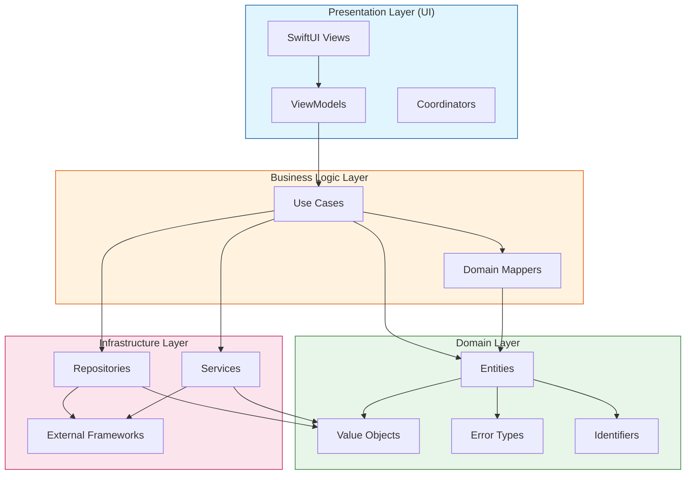

**Dependency Rule**: Dependencies flow inward only (outer layers depend on inner layers, never the reverse).

---

## 2. Session Lifecycle Flow

### Complete Session Flow: Start → Record → Transcribe → Stop → Save

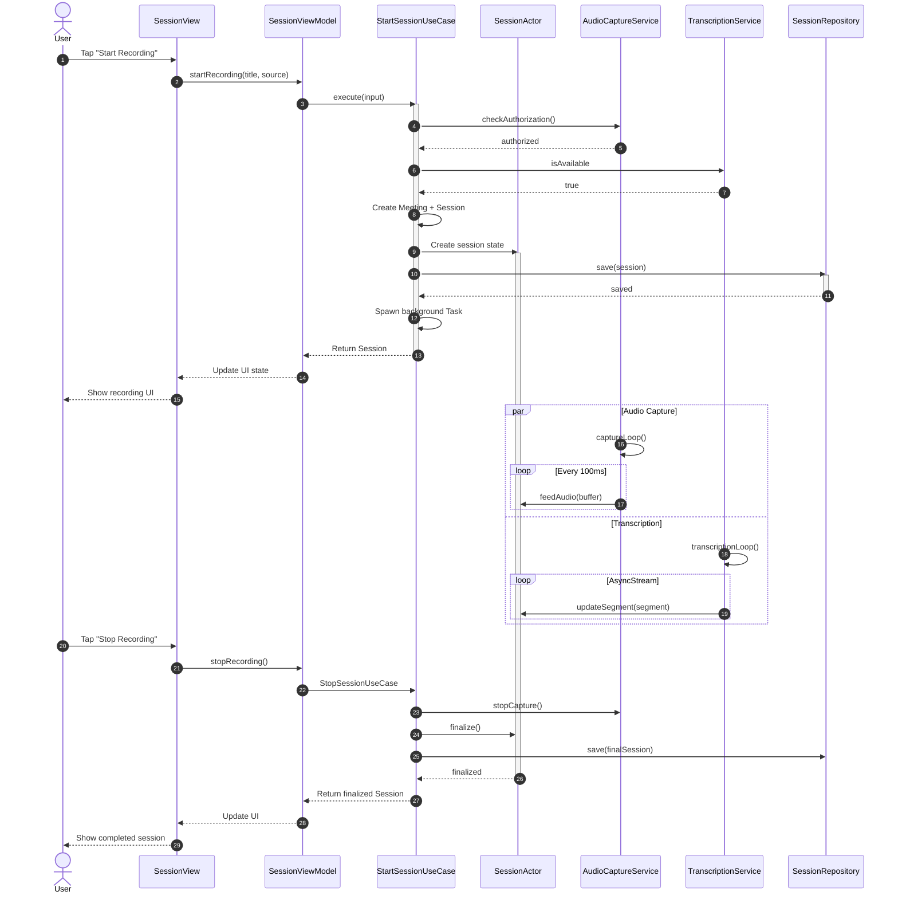

---

## 3. Real-Time Transcription Flow

### Audio → Segments → UI Updates with Actor Isolation

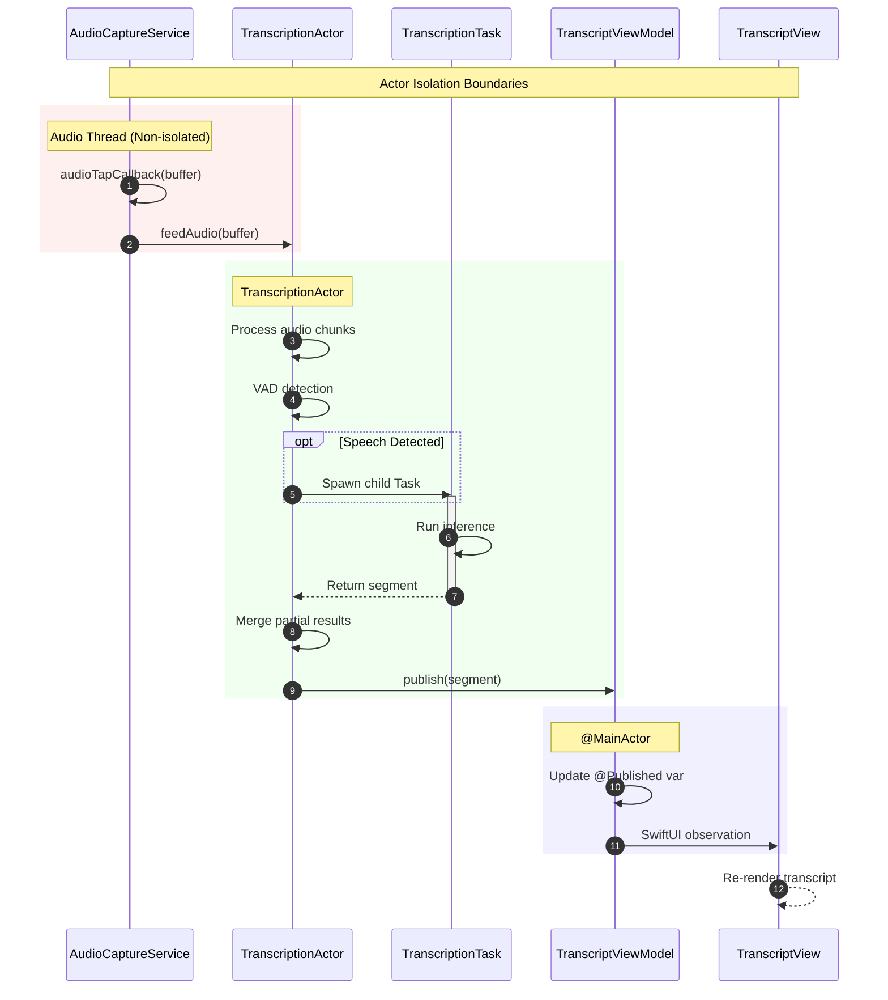

---

## 4. Note Generation Flow

### Transcript → AI → Notes → Display

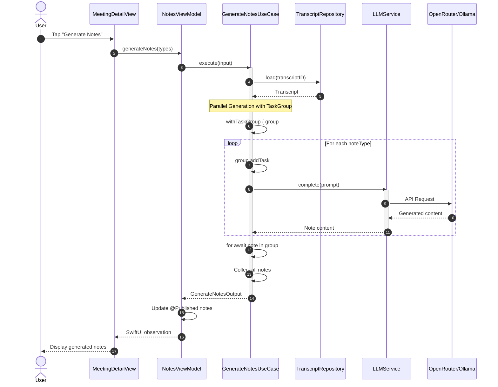

---

## 5. Error Propagation Flow

### How Errors Flow: Infrastructure → Business → Presentation

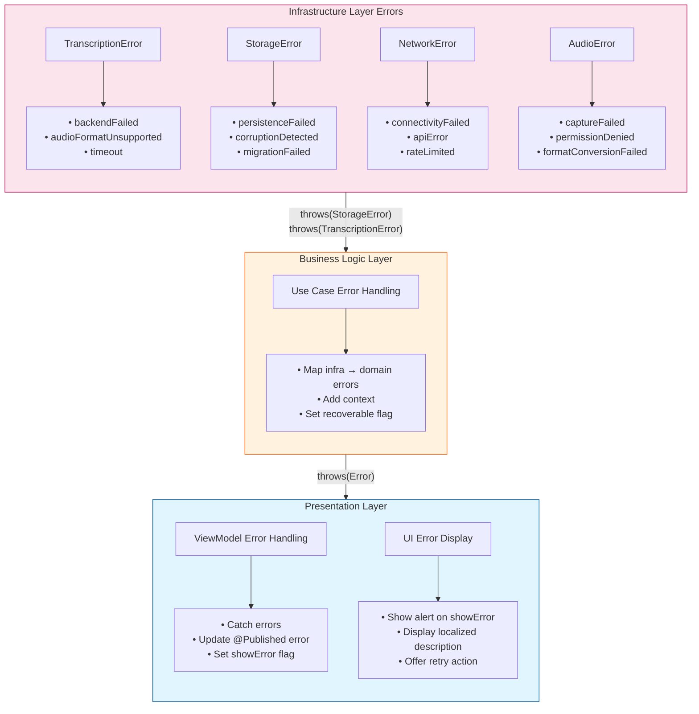

### Detailed Error Propagation Sequence

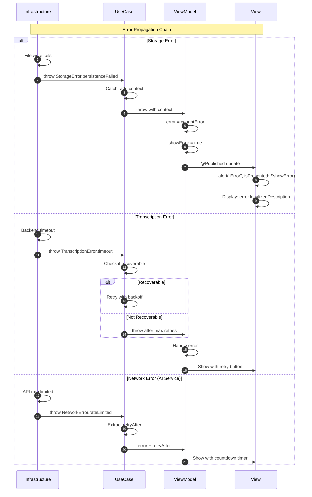

---

## 6. Dependency Injection Flow

### AppContainer Initialization and Dependency Resolution

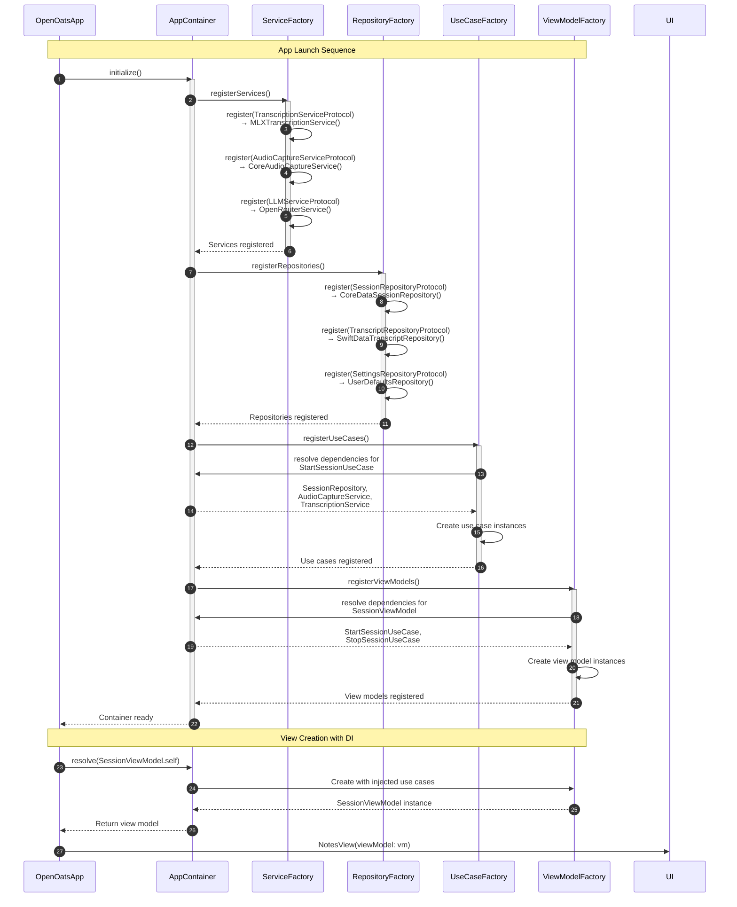

---

## 7. Backend Abstraction Flow

### Multiple Transcription Backends with Unified Interface

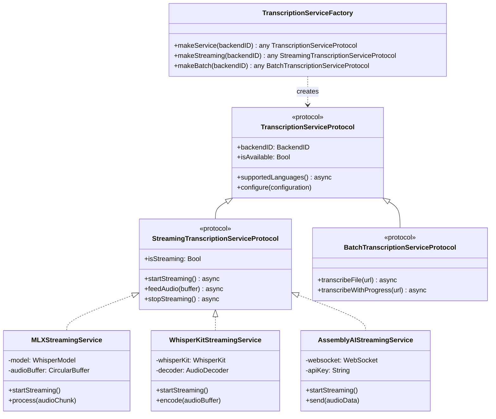

### Backend Switching Sequence

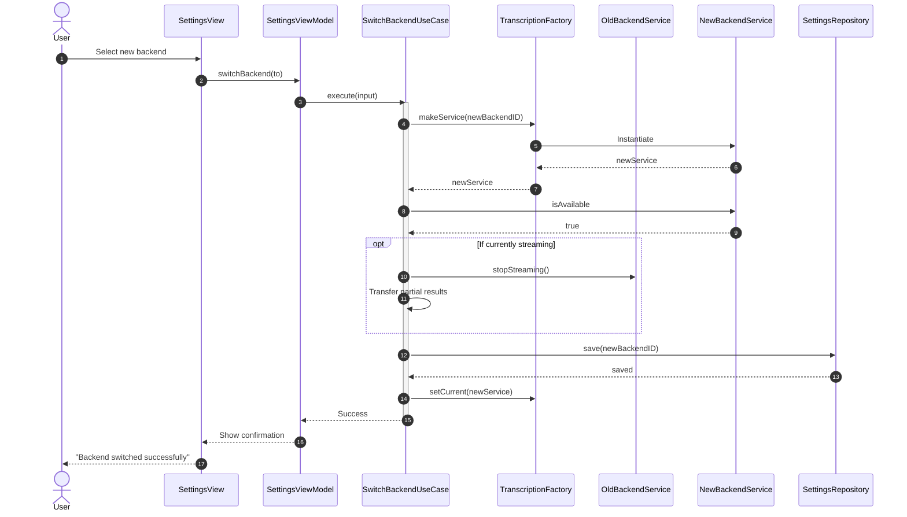

---

## 8. Data Race Fix Flow (TASK-015)

### Before: @unchecked Sendable with Data Race Risk

```mermaid
flowchart LR
    subgraph Before["Before: Unsafe"]
        A[Thread 1] -->|"writes converter"| ST[StreamingTranscriber<br/>@unchecked Sendable]
        B[Thread 2] -->|"writes converter"| ST
        C[Audio Thread] -->|"reads converter"| ST
        
        note["Risk: EXC_BAD_ACCESS<br/>from concurrent access"]
    end
    
    style Before fill:#ffcccc,stroke:#cc0000
```

### After: Actor-Protected State

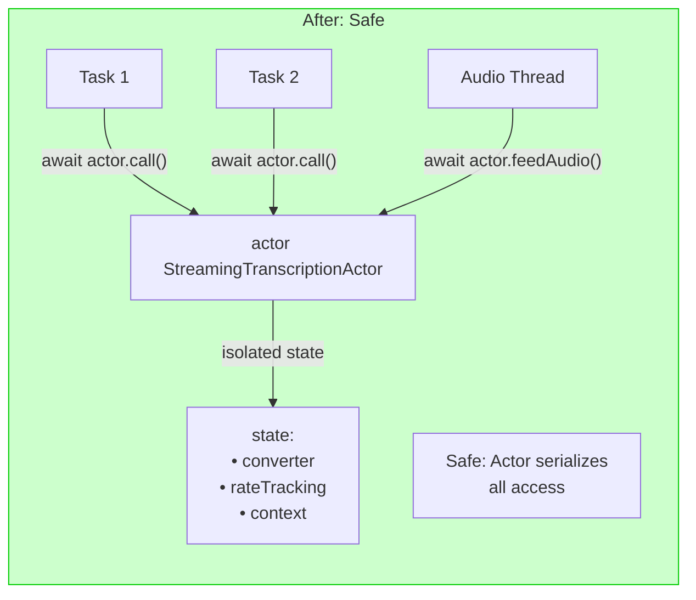

### Actor Isolation Sequence

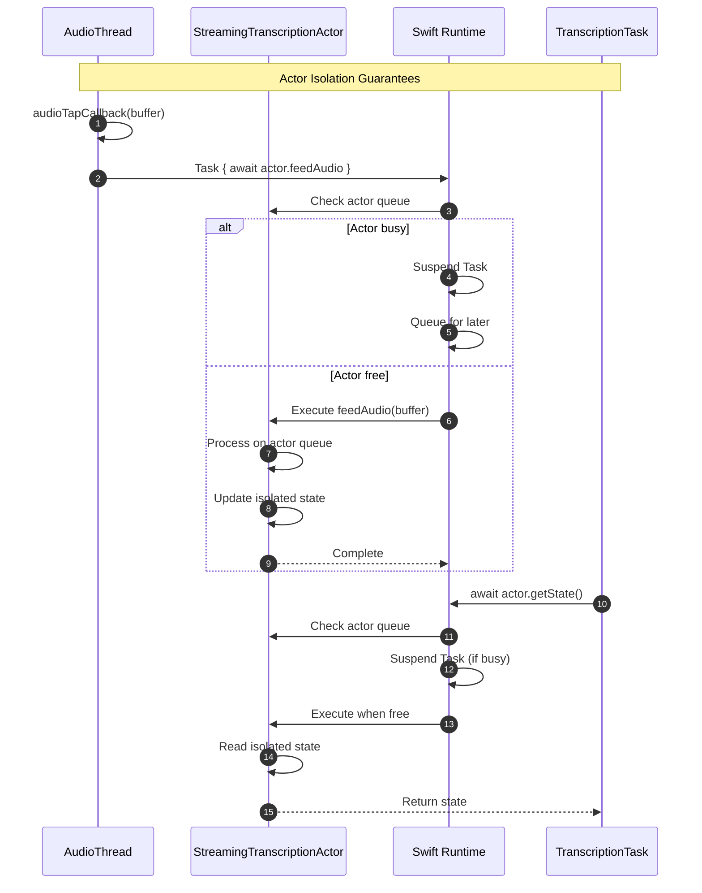

---

## 9. Memory Management Flow (TASK-016)

### Streaming Audio Processing (vs Load-All)

```mermaid
flowchart TB
    subgraph Old["Before: Unbounded Memory"]
        direction TB
        REC[2hr Recording<br/>48kHz] --> LOAD[readAllMono()]
        LOAD --> ARR["[Float] Array<br/>~2.6 GB"]
        ARR --> OOM[OOM Crash<br/>on 8GB Macs]
        
        style Old fill:#ffcccc,stroke:#cc0000
    end
    
    subgraph New["After: Bounded Memory"]
        direction TB
        REC2[Recording Stream] --> CHUNK[64K Frame Chunks]
        CHUNK --> POOL[Buffer Pool<br/>~768 KB max]
        POOL --> PROC[Process Chunk]
        PROC --> REUSE[Return to Pool]
        REUSE --> CHUNK
        
        style New fill:#ccffcc,stroke:#00cc00
    end
```

### AudioBuffer Pool Sequence

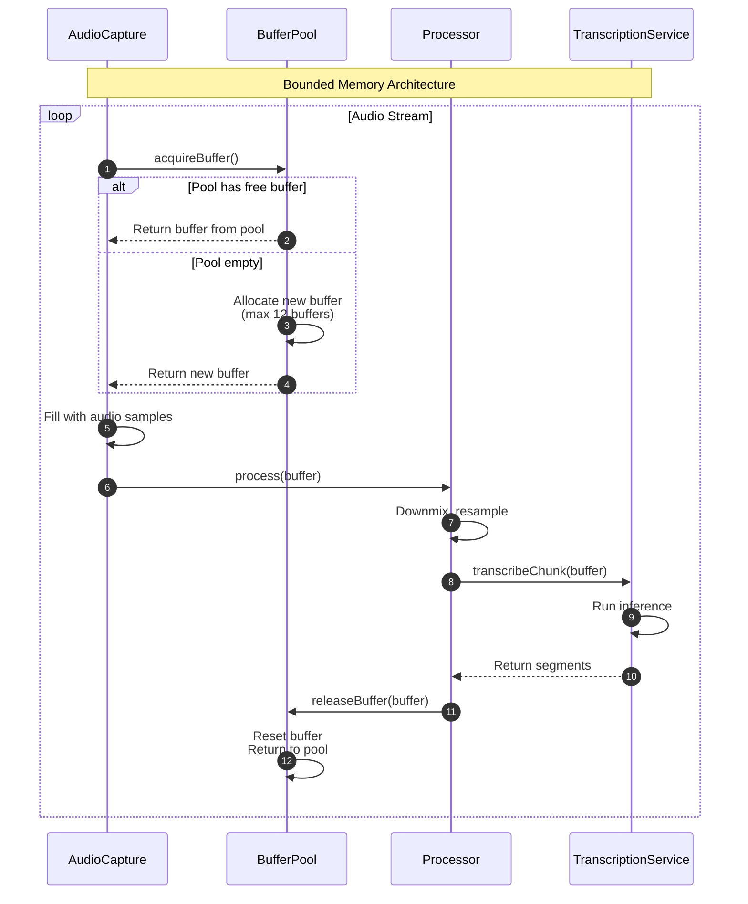

---

## 10. SwiftUI Observation Pattern

### @Observable vs ObservableObject

```mermaid
flowchart TB
    subgraph OldPattern["ObservableObject Pattern"]
        VM1[SessionViewModel<br/>@Published var state]
        VM1 -->|"objectWillChange.send()"| OBS1[SwiftUI Observation]
        OBS1 -->|"Re-render view"| UI1[SessionView]
        
        note["Works on all iOS versions<br/>More boilerplate<br/>ObservableObject protocol"]
    end
    
    subgraph NewPattern["@Observable Pattern"]
        VM2[@Observable<br/>SessionViewModel<br/>var state]
        VM2 -->|"Automatic tracking"| OBS2[SwiftUI Observation]
        OBS2 -->|"Granular re-render"| UI2[SessionView]
        
        note["iOS 17+ only<br/>Less boilerplate<br/>Automatic dependency tracking"]
    end
    
    style OldPattern fill:#fff3e0,stroke:#e65100
    style NewPattern fill:#e8f5e9,stroke:#2e7d32
```

### Recommended Pattern for OpenOats

```swift
// For macOS 15+ targets, use @Observable
@MainActor
@Observable
class SessionViewModel {
    var isRecording: Bool = false
    var recordingDuration: Duration = .zero
    var currentSession: Session?
    
    // Dependencies injected
    private let startUseCase: any StartSessionUseCaseProtocol
    
    init(startUseCase: any StartSessionUseCaseProtocol) {
        self.startUseCase = startUseCase
    }
    
    func startRecording() async {
        // Observation is automatic
        isRecording = true
        
        let session = try? await startUseCase.execute(input: input)
        currentSession = session
    }
}
```

---

## Summary

These diagrams illustrate:

| Diagram | Purpose | Key Insight |
|---------|---------|-------------|
| Architecture Overview | Layer structure | 4 layers with inward-only dependencies |
| Session Lifecycle | Recording flow | Actor isolation at each boundary |
| Real-time Transcription | Audio → UI | AsyncStream for real-time updates |
| Note Generation | AI integration | TaskGroup for parallel generation |
| Error Propagation | Error handling | Typed throws with context preservation |
| Dependency Injection | App startup | Factory pattern with protocol conformance |
| Backend Abstraction | Multiple backends | Unified interface, swappable implementations |
| Data Race Fix | Thread safety | Actor isolation replaces @unchecked Sendable |
| Memory Management | Bounded memory | Buffer pool pattern prevents OOM |
| SwiftUI Observation | UI updates | @Observable for automatic tracking |

**All diagrams use standard Mermaid syntax** and can be rendered in:
- GitHub markdown
- Notion
- Obsidian
- VS Code with Mermaid extension
- Any Mermaid-compatible renderer

---

**Status**: Design deliverable complete
